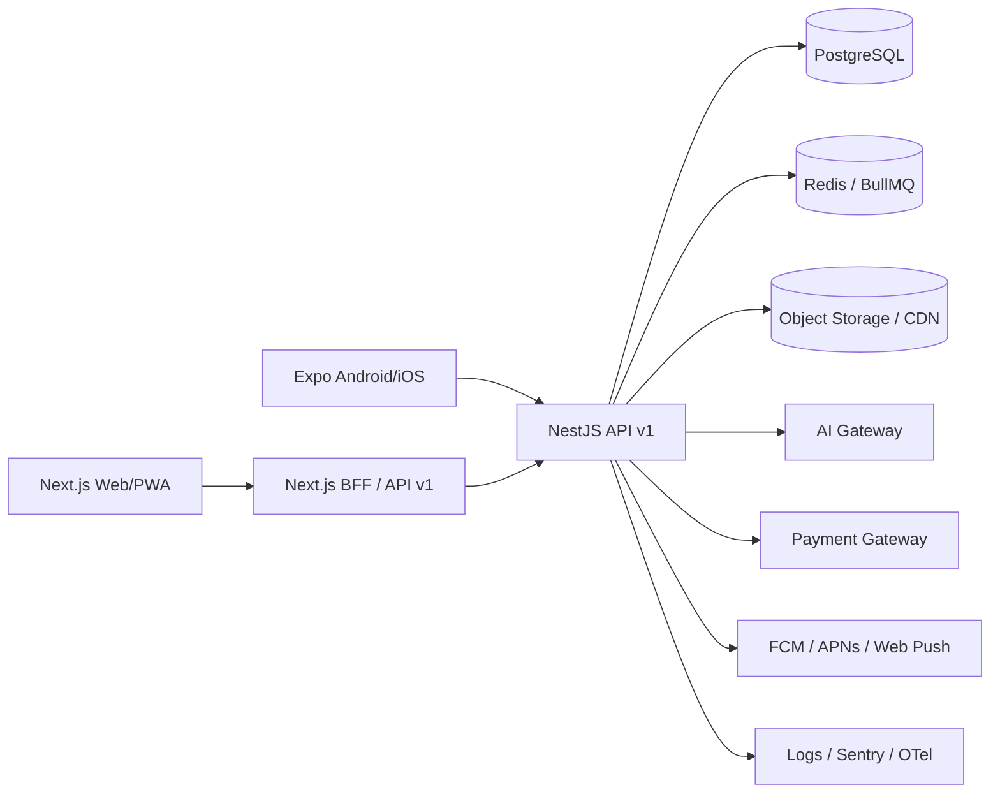

# معماری محصول تجاری فَنی‌اکسو

> نسخه سند: 1.0 — ۲۷ تیر ۱۴۰۵  
> وضعیت: معماری هدف تأییدشده برای توسعه مرحله‌ای بدون حذف داده‌های فعلی

## ۱. تصمیم‌های اصلی معماری

فَنی‌اکسو هم‌اکنون یک محصول عملیاتی با Next.js، PostgreSQL، پنل هنرجو، پنل آموزشگاه، مدیریت کل، فروش آنلاین، چت، آزمون، تکلیف، مالی و هوش مصنوعی است. بنابراین بازنویسی یک‌باره از صفر، ریسک ازبین‌رفتن داده و توقف سرویس دارد.

راهکار تجاری انتخاب‌شده **Strangler Architecture** است:

1. وب فعلی بدون توقف فعال می‌ماند.
2. قراردادهای API نسخه‌دار می‌شوند.
3. اپ موبایل با React Native و Expo توسعه می‌یابد.
4. دامنه‌های پرترافیک به‌تدریج از Route Handlerهای Next.js به NestJS منتقل می‌شوند.
5. دیتابیس فعلی با Migrationهای افزایشی توسعه پیدا می‌کند؛ هیچ جدول عملیاتی حذف نمی‌شود.
6. فایل‌ها به‌تدریج از Base64/PostgreSQL به Object Storage منتقل می‌شوند.

## ۲. فناوری‌های انتخاب‌شده

| لایه | فناوری هدف | دلیل |
|---|---|---|
| وب و PWA | Next.js 16 + React 19 + TypeScript | SSR، SEO، PWA، پنل‌های فعلی و توسعه سریع |
| اپ Android/iOS | React Native + Expo + Expo Router | اشتراک دانش React/TypeScript و تحویل هم‌زمان دو پلتفرم |
| API اصلی | NestJS + REST API نسخه‌دار | ماژولار، تست‌پذیر، Guard، Queue و OpenAPI |
| BFF وب | Next.js Route Handlers | سازگاری با وب فعلی در دوره مهاجرت |
| دیتابیس | PostgreSQL / Neon | داده رابطه‌ای، تراکنش مالی و زیرساخت فعلی |
| Cache و Queue | Redis + BullMQ | کش، Rate Limit، اعلان و پردازش ویدئو |
| فایل و ویدئو | S3-compatible Object Storage + CDN | آپلود امن، لینک امضاشده و کاهش فشار دیتابیس |
| احراز هویت وب | NextAuth | سازگاری با سیستم فعلی |
| احراز هویت موبایل | JWT کوتاه‌مدت + Refresh Token چرخشی + OAuth | امنیت دستگاه موبایل و ورود پایدار |
| Push | FCM + APNs + Web Push | Android، iOS و PWA |
| مشاهده‌پذیری | OpenTelemetry + Sentry + Structured Logs | ردیابی خطا و کارایی |
| CI/CD | GitHub Actions + Vercel + EAS Build | تست، وب و خروجی موبایل |

## ۳. نمای کلان سیستم



## ۴. دامنه‌های تجاری Backend

### ۴.۱ Identity & Access

- کاربران و پروفایل
- نقش‌ها: `student`, `instructor`, `institute_manager`, `super_admin`, `support`, `finance`
- Permissionهای جزئی به‌جای اتکای صرف به Role
- دستگاه‌های فعال
- Refresh Token چرخشی
- OAuth گوگل/اپل در موبایل
- OTP و بازیابی رمز
- Audit Log ورود و عملیات حساس

### ۴.۲ Institute Management

- آموزشگاه، شعبه، مدیر و مجوز
- پلن اشتراک و Entitlement
- صفحه حرفه‌ای، گالری، استوری و بنر
- امکانات، FAQ، خبر، افتخار، شریک تجاری و مشاور
- تایید هویت و وضعیت فعالیت

### ۴.۳ Course Catalog

- دوره حضوری، آنلاین، ترکیبی و رایگان
- مدرس، دسته‌بندی، سطح، پیش‌نیاز و مخاطب
- فصل، درس، فایل، ویدئو، کلاس زنده و پیش‌نمایش
- نسخه پیش‌نویس، بازبینی و انتشار
- ظرفیت، زمان‌بندی، تخفیف و ویژگی‌ها

### ۴.۴ Learning Management

- ثبت‌نام و Enrollment
- پیشرفت درس‌به‌درس
- حضور و غیاب
- تکلیف و Submission
- آزمون، سوال، Attempt و نمره‌دهی
- کارنامه و گواهینامه دیجیتال
- مسیر یادگیری و پیشنهاد ادامه دوره

### ۴.۵ Commerce & Finance

- سبد خرید
- سفارش و آیتم سفارش
- پرداخت و Callback
- کد تخفیف و Campaign
- فاکتور
- Refund
- کیف پول
- شهریه، اقساط، آزمون، مدرک و هزینه جانبی
- کمیسیون آموزشگاه و تسویه
- گزارش مالی و مغایرت‌گیری

### ۴.۶ Communication

- چت مستقیم و گروه دوره
- پیام فایل‌دار
- تیکت و SLA
- اعلان درون‌برنامه‌ای
- Push Notification
- Email/SMS/Telegram Adapter
- تنظیمات Quiet Hours و Preference کاربر

### ۴.۷ AI Learning

- چت آموزشی فارسی
- Grounding روی داده دوره و آموزشگاه
- خلاصه درس
- تولید آزمون با تایید مدرس
- پیشنهاد دوره و مسیر یادگیری
- دستیار مدیر و مدرس
- ثبت Usage، هزینه و Rate Limit
- Guardrail و جلوگیری از جعل اطلاعات

### ۴.۸ Content & CMS

- اخبار و مقاله
- اسلایدر و محتوای صفحه اصلی
- FAQ عمومی
- SEO و Metadata
- Draft/Publish و تاریخ انتشار

## ۵. ساختار دیتابیس هدف

### جداول هویت

- `users`
- `roles`
- `permissions`
- `user_roles`
- `role_permissions`
- `user_devices`
- `refresh_tokens`
- `oauth_accounts`
- `login_events`
- `audit_logs`

### جداول آموزشگاه و مدرس

- `institutes`
- `institute_branches`
- `institute_managers`
- `institute_subscriptions`
- `subscription_plans`
- `instructors`
- `instructor_social_links`
- `instructor_institutes`
- `institute_profile_sections`
- `institute_media`
- `institute_leads`

### جداول دوره

- `courses`
- `course_versions`
- `course_categories`
- `course_instructors`
- `course_chapters`
- `course_lessons`
- `lesson_assets`
- `live_classes`
- `course_schedules`
- `course_sessions`

### جداول یادگیری

- `enrollments`
- `lesson_progress`
- `attendance`
- `assignments`
- `assignment_submissions`
- `quizzes`
- `quiz_questions`
- `quiz_options`
- `quiz_attempts`
- `grades`
- `certificates`

### جداول فروش و مالی

- `carts`
- `cart_items`
- `orders`
- `order_items`
- `payments`
- `payment_events`
- `discount_codes`
- `invoices`
- `refunds`
- `wallets`
- `wallet_transactions`
- `payment_fees`
- `settlements`
- `settlement_items`

### جداول ارتباطی

- `chat_threads`
- `chat_messages`
- `message_groups`
- `group_members`
- `tickets`
- `ticket_replies`
- `notifications`
- `push_subscriptions`
- `notification_preferences`

### جداول محتوا و اعتماد

- `reviews`
- `review_media`
- `articles`
- `news`
- `stories`
- `faqs`
- `favorites`
- `reports`

## ۶. قواعد مهم داده

1. پول در دیتابیس با عدد صحیح و واحد تومان نگهداری می‌شود.
2. تمام Payment Callbackها Idempotent هستند.
3. تعداد خرید از Payment/Order واقعی محاسبه می‌شود و عدد نمایشی جعلی ندارد.
4. امتیاز از Review منتشرشده محاسبه می‌شود.
5. حذف اطلاعات مالی Soft Delete است.
6. فایل‌ها در دیتابیس ذخیره نمی‌شوند؛ فقط Metadata و Object Key ثبت می‌شود.
7. تمام تاریخ‌ها در دیتابیس UTC و نمایش برای کاربر شمسی است.
8. هر داده آموزشگاه با `institute_id` و Policy دسترسی تفکیک می‌شود.
9. تغییر نمره، پرداخت، گواهینامه و نقش در Audit Log ثبت می‌شود.

## ۷. قرارداد API

- Prefix: `/api/v1`
- پاسخ موفق:

```json
{
  "data": {},
  "meta": {},
  "requestId": "uuid"
}
```

- پاسخ خطا:

```json
{
  "error": {
    "code": "VALIDATION_ERROR",
    "message": "متن قابل نمایش",
    "fields": {}
  },
  "requestId": "uuid"
}
```

- Pagination: Cursor-based
- مستندات: OpenAPI 3.1
- Versioning: URI Versioning
- Idempotency-Key برای Order و Payment
- Rate Limit بر اساس User، Device و IP

## ۸. صفحات و مسیرهای وب/PWA

### عمومی

- صفحه اصلی
- فهرست رشته‌ها
- فهرست آموزشگاه‌ها
- صفحه حرفه‌ای آموزشگاه
- فهرست دوره حضوری
- فروشگاه آنلاین
- صفحه دوره
- مقاله و خبر
- جست‌وجوی سراسری
- مقایسه آموزشگاه/دوره
- دستیار هوشمند
- قیمت‌گذاری

### هنرجو

- داشبورد
- دوره‌های حضوری
- دوره‌های آنلاین
- پخش‌کننده
- تقویم
- کلاس Live
- تکلیف
- آزمون
- نمرات و کارنامه
- حضور
- گواهینامه
- شهریه و اقساط
- کیف پول و فاکتور
- چت و گروه
- تیکت
- اعلان
- علاقه‌مندی
- رزومه و نمونه‌کار
- امنیت و دستگاه‌ها

### مدرس

- داشبورد مدرس
- دوره‌های من
- Course Builder
- آپلود و مدیریت ویدئو
- فصل و درس
- دانشجویان
- حضور
- تکلیف و بازخورد
- آزمون و بانک سوال
- کلاس Live
- پرسش و پاسخ
- فروش و درآمد
- پروفایل حرفه‌ای

### مدیر آموزشگاه

- داشبورد
- آموزشگاه و شعبه
- مدرس‌ها
- دوره حضوری
- دوره آنلاین
- هنرجویان
- جلسات
- حضور و نمره
- تکلیف و آزمون
- فروش و خریدها
- شهریه و اقساط
- گزارش مالی
- محتوا و صفحه عمومی
- نظرات
- چت، گروه، تیکت و اعلان
- اشتراک و مصرف
- تنظیمات دسترسی

### مدیر کل

- سلامت سامانه
- کاربران و نقش‌ها
- آموزشگاه و مجوز
- اشتراک‌ها
- دوره و محتوای گزارش‌شده
- سفارش، پرداخت و تسویه
- تیکت و پشتیبانی
- CMS
- اعلان و Push
- AI Usage/Cost
- Audit Log
- گزارش‌های مدیریتی

## ۹. مسیرهای اصلی کاربر

### خرید و یادگیری آنلاین

`جست‌وجو → صفحه دوره → پیش‌نمایش → افزودن به سبد → کد تخفیف → پرداخت → فاکتور → فعال‌شدن Enrollment → پخش درس → پیشرفت → آزمون → مدرک`

### ثبت‌نام حضوری

`دوره حضوری → درخواست ثبت‌نام → تایید مدیر → تعریف شهریه/اقساط → تقویم → حضور → نمره → گواهینامه`

### ساخت دوره توسط مدرس

`ایجاد پیش‌نویس → اطلاعات دوره → فصل/درس → آپلود → آزمون/تکلیف → ارسال برای بازبینی → تایید مدیر → انتشار`

### پشتیبانی

`ایجاد تیکت → دسته‌بندی و اولویت → پاسخ پشتیبان → اعلان Push → حل → ارزیابی رضایت`

## ۱۰. امنیت

- Argon2id/Bcrypt برای رمز عبور
- Access Token حداکثر ۱۵ دقیقه
- Refresh Token چرخشی و ذخیره Hash
- SecureStore/Keychain در موبایل
- CSRF برای وب Cookie-based
- CORS Allowlist برای Mobile/API
- Validation سراسری با Zod/Class Validator
- Helmet، CSP و Security Header
- Signed URL برای فایل خصوصی
- Virus Scan برای Upload
- محدودیت حجم و MIME Type
- Rate Limiting و Brute Force Protection
- MFA برای مدیر کل و امور مالی
- Row/Service-level authorization
- Audit Log غیرقابل‌ویرایش برای عملیات حساس
- Backup و Restore Drill دوره‌ای

## ۱۱. استراتژی ویدئو

1. درخواست Upload Session
2. آپلود Multipart مستقیم به Object Storage
3. ثبت Asset با وضعیت `uploaded`
4. Queue پردازش ویدئو
5. Transcode به HLS چند کیفیت
6. تولید Thumbnail و Duration
7. ذخیره Manifest
8. پخش با Signed URL کوتاه‌مدت
9. ثبت Watch Progress دوره‌ای
10. جلوگیری از دسترسی کاربر فاقد Enrollment

## ۱۲. اعلان Push

- ثبت Device Token برای هر دستگاه
- Topicهای دوره و آموزشگاه
- Template قابل مدیریت
- Queue و Retry
- Deep Link به صفحه مقصد
- ثبت Delivery/Open
- تنظیم دریافت اعلان توسط کاربر
- Fallback به اعلان درون‌برنامه‌ای و Telegram/SMS

## ۱۳. PWA

- Manifest استاندارد و Maskable Icon
- Service Worker امن
- عدم Cache پنل‌ها، API، پرداخت و اطلاعات خصوصی
- Offline Fallback برای صفحات عمومی
- نصب روی Android و Desktop
- Apple Web App metadata
- Install Prompt غیرمزاحم

## ۱۴. تست

- Unit Test برای Domain Serviceها
- Integration Test دیتابیس و Payment
- Contract Test API
- E2E با Playwright
- Mobile E2E با Maestro/Detox
- Accessibility با axe
- Load Test با k6
- Security Test و Dependency Scan

## ۱۵. DevOps و محیط‌ها

- `development`
- `staging`
- `production`

Pipeline:

1. Install locked dependencies
2. Lint
3. Typecheck
4. Unit/Integration Test
5. Build Web/API/Mobile
6. Migration Check
7. Deploy Staging
8. E2E Smoke Test
9. Approval
10. Production Deploy
11. Post-deploy Health Check

## ۱۶. راهبرد مهاجرت بدون حذف داده

1. Backup قبل از Migration
2. فقط `ADD TABLE/COLUMN/INDEX`
3. Backfill جدا از Deploy
4. Dual Read برای مدت محدود
5. Dual Write هنگام انتقال دامنه
6. کنترل Count/Checksum
7. تغییر Read Path
8. دوره مشاهده
9. حذف کد قدیمی؛ حذف جدول فقط در Release مستقل و بعد از Backup

## ۱۷. تعریف Done تجاری

هر قابلیت زمانی Done است که:

- UX موبایل و دسکتاپ کامل باشد.
- API Validation و Authorization داشته باشد.
- تست حداقل مسیر موفق و خطا نوشته شده باشد.
- Event و Audit لازم ثبت شود.
- حالت Loading/Empty/Error مشخص باشد.
- RTL و Accessibility بررسی شود.
- مستند API و راهنمای استفاده به‌روز شود.
- Build و Smoke Test تولید موفق باشد.
